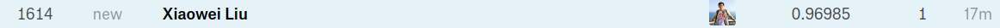

# DigitRecognizer_kaggle
[Digit Recognizer](https://www.kaggle.com/c/digit-recognizer/data) on kaggle.

### Position on the Kaggle leaderboard

### Model Plot
1. `xgb.plot_tree(bst, num_trees=2)`

2. Root of the model tree

3. Right Sub-Tree of the model tree

4. Leaf node of the model tree

