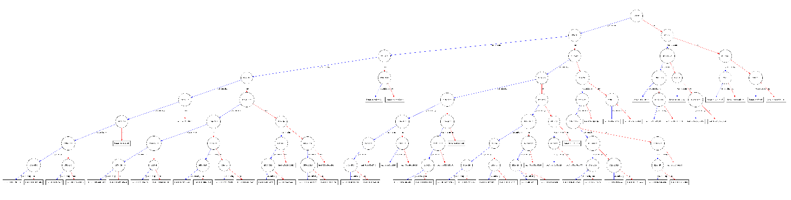
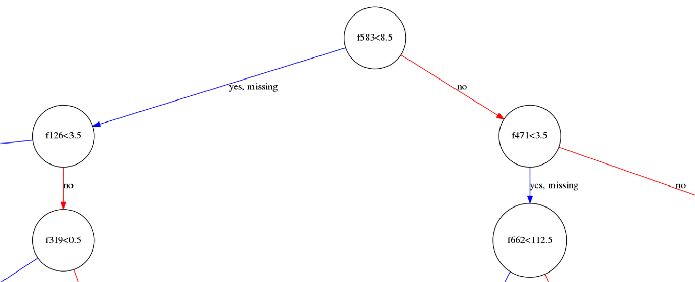
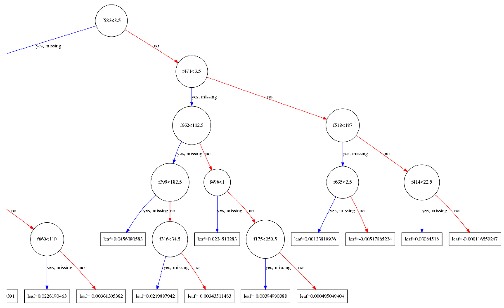
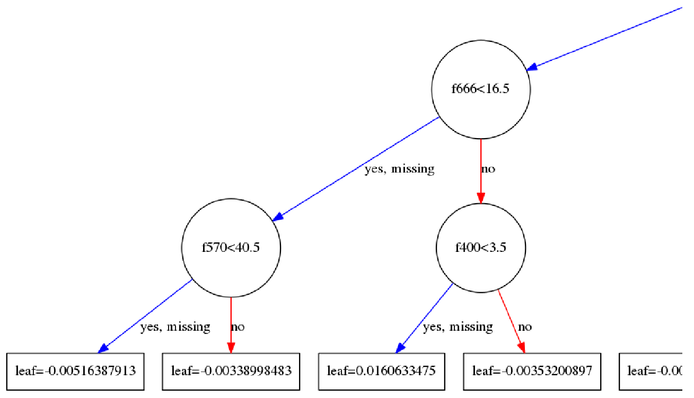
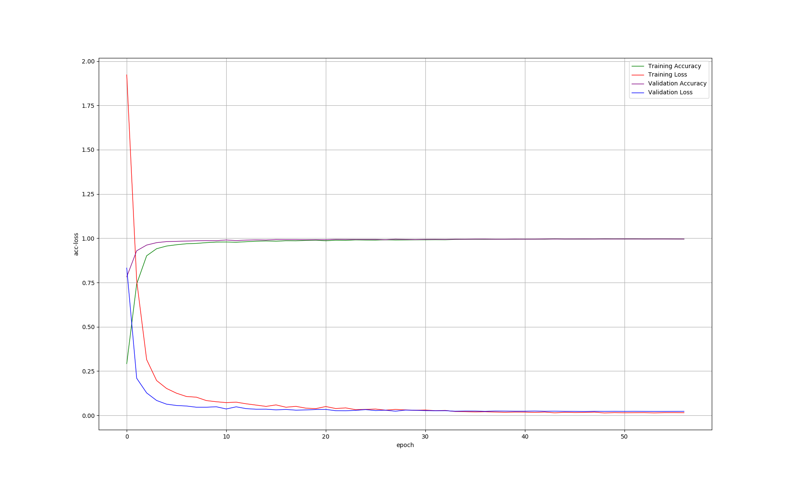

# DigitRecognizer
Kaggle竞赛入门题目[Digit Recognizer](https://www.kaggle.com/c/digit-recognizer/data)实现

## 1. 不同实现方法的得分
以下各种实现方法的得分是针对相应代码中的参数和网络结构设计的情况下的得分, **此处不表示各种算法本身的性能对比**

| 实现方法 | Score | 迭代次数(采用early stopping)近似值 | 说明 |
| :--- | :---: | :---: | :--- |
| **XGBoost** | 0.96985 | 1700 | 见src/xgboost_method.py |
| **CNN V1.0** | 0.98757 | 60 | EarlyStopping(patience=50) |
| **CNN V2.0** | 0.98900 | 28 | 与v1.0区别: 1.调整EarlyStopping(patience=10)  2.样本数据做了归一化(除以255, 转换到0~1) |
| **CNN V3.0** | 0.99142 | 80 | 与v2.0区别: 1.采用Data Augmentation  2.采用ReduceLROnPlateau(v3.0的两处修改都很有效) |
| **CNN V4.0** | 0.99428 | 64 | 与v3.0区别: 1.增加网络层数  2.调整ReduceLROnPlateau的monitor="val_acc"->"val_loss", patience=3->5, factor=0.5->0.2 |
| **CNN V5.0** | **0.99514** | 57 | 与v4.0区别: 进一步增加网络层数 |
| **CNN V6.0** | 0.99385 | 59 | 与v5.0区别: 1.进一步增加网络层数 2.增加了ModelCheckpoint 3.history写入文件 |
| **CNN V7.0** | **0.99514** | 47 | 与v6.0区别: 第三四层Conv2D的kernel_size取值由(3, 3)调整为(5, 5) |

## 2. 关于预处理
拿到数据首先应该做的就是预处理, 包括一些数据统计工作, 例如**统计样本的数据分布情况(label是否分布均匀)**, **查看样本数据缺失值的情况(并填补缺失值)**, **标准化&归一化**, **to_categorical**, **reshape**, **train_test_split**, **数据扩充(data augmentation)**, **特征提取**, **特征选择**, **降维**等

## 3. XGBoost实现方法结果绘制
1. `xgb.plot_tree(bst, num_trees=2)`

2. 根节点 

3. 右子树节点

4. 叶子节点

## 4. CNN实现方法acc loss曲线绘制(V7.0)

