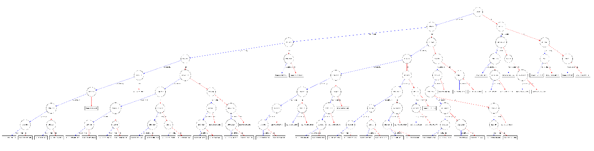
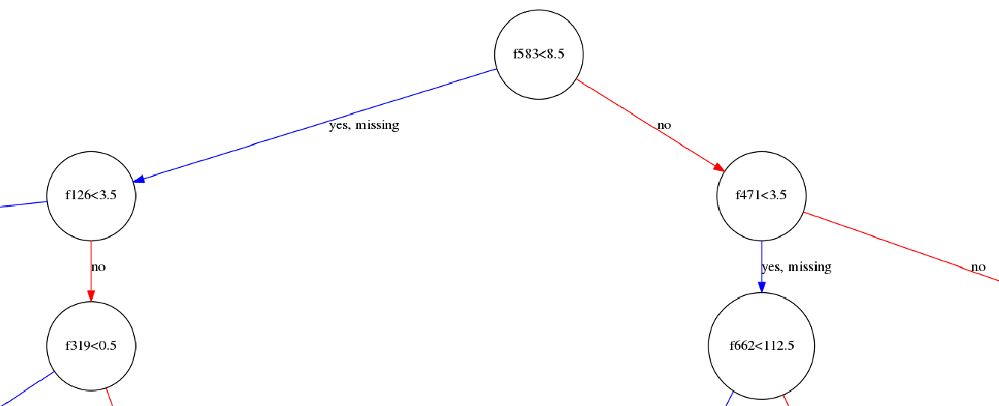
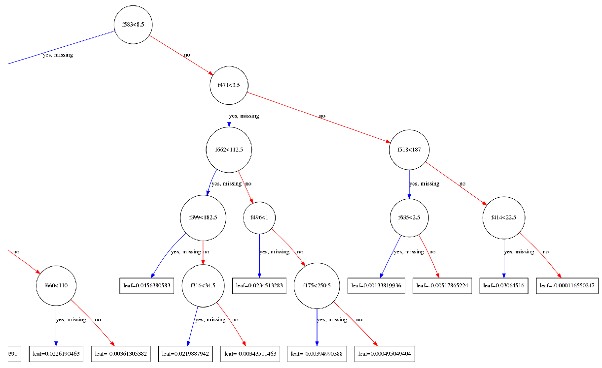
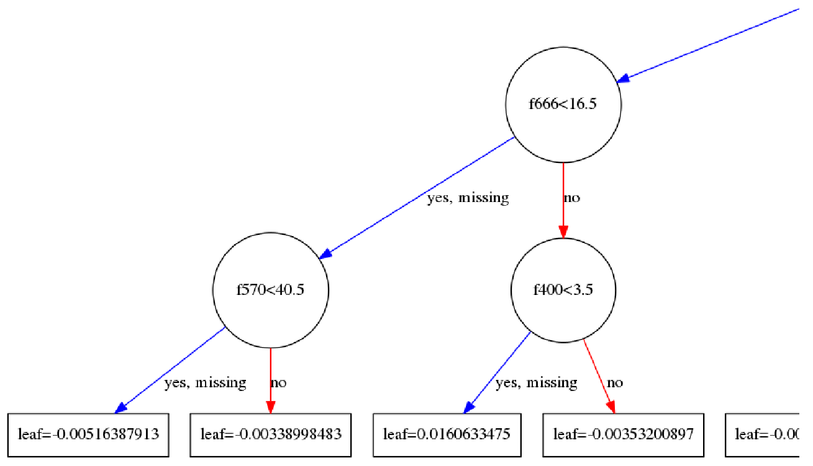

# DigitRecognizer_kaggle
kaggle入门竞赛题目[Digit Recognizer](https://www.kaggle.com/c/digit-recognizer/data)实现方法汇总

## 1. 不同实现方法的得分
以下各种实现方法的得分是针对相应代码中的参数和网络结构设计的情况下的得分, **此处不表示各种算法本身的性能对比**

| 实现方法 | Score | 迭代次数(采用early stopping)近似值 |
| --- | --- | --- |
| **XGBoost** | 0.96985 | 1700 |
| **CNN** | 0.98757 | 60 |

## 2. 关于预处理
拿到数据首先应该做的就是预处理, 包括一些数据统计工作, 例如

## 3. XGBoost实现方法结果绘制
1. `xgb.plot_tree(bst, num_trees=2)`

2. 根节点 

3. 右子树节点

4. 叶子节点

